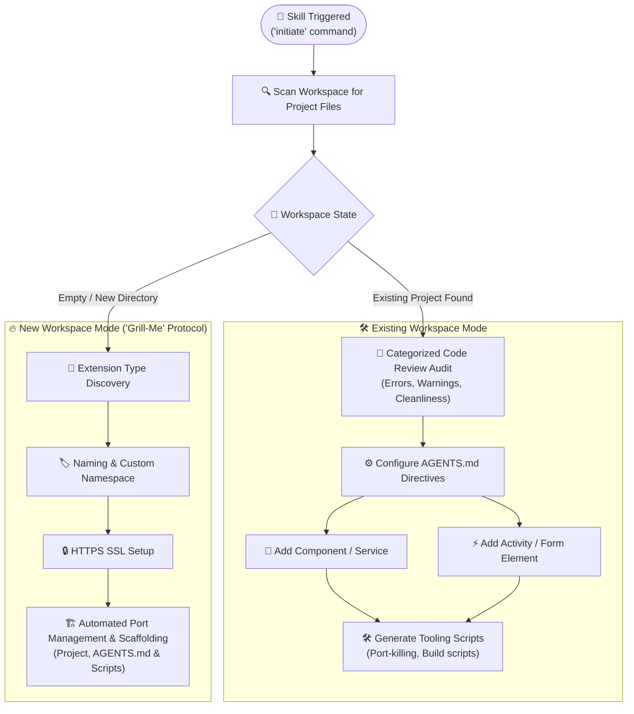

<p align="center">
  <a href="https://geosynk.com.au/" target="_blank" rel="noopener noreferrer">
    
  </a>
</p>

# VertiGIS SDK AI Skills

[](https://geosynk.com.au/)
[](#what-are-ai-skills)
[](https://developers.vertigisstudio.com/docs/web/overview/)
[](https://developers.vertigisstudio.com/docs/workflow/sdk-web-overview)

This repository contains expertly crafted AI instructions ("Skills") designed to teach Large Language Models (LLMs) how to generate production-ready, enterprise-grade code for the VertiGIS Studio Web SDK and VertiGIS Studio Workflow SDK.

## What are AI Skills?
AI Skills are robust, system-prompt-style markdown documents that provide an LLM with strict architectural guardrails, best practices, and canonical code patterns. By providing these documents as context to an AI agent (like GitHub Copilot, ChatGPT, or Google Gemini), you ensure the AI generates code that strictly adheres to the VertiGIS SDK standards rather than hallucinating generic React or TypeScript code.

---

## 💡 Usage & Interactive Consultation ("Grill-Me" Protocol)

When an AI assistant is equipped with these skills, it doesn't just guess or output arbitrary boilerplate. It actively follows an interactive consultation flow:



### 1. Existing Workspace Mode
If the agent detects an existing VertiGIS project, it prompts you before modifying files:
- **Configure AGENTS.md Directives (`initiate`)**: Run `python3 vertigis-web-sdk-skill/scripts/initiate_agents_md.py` or `python3 vertigis-workflow-sdk-skill/scripts/initiate_agents_md.py` to automatically configure or update `AGENTS.md` in the target repository with scoped directives (`<!-- vertigis-web-sdk:start -->` or `<!-- vertigis-workflow-sdk:start -->`) without overwriting other custom instructions.
- **Categorized Code Review Audit**: Audits your codebase with distinct severity levels (🔴 **Critical Errors**, 🟡 **Architectural Warnings**, 🔵 **Cleanliness Recommendations**) tailored to the extension type (Web Components, Services, Workflow Activities, or Form Elements), including strict checks for Typography and Design Token compliance.
- **Extension Scaffolding**: Scaffolds new Components and Services (Web SDK) or new Activities and Form Elements (Workflow SDK) adhering to canonical directory structures.
- **Tooling Generation**: Generates automated port-killing start scripts and build scripts.

### 2. New Workspace Mode ("Grill-Me" Interview)
If the workspace is uninitialized, the agent conducts a focused questionnaire to align on requirements before generating code:
- **Extension Type**: Clarifies whether you are targeting Web Components, Web Services, Workflow Activities, or Custom Form Elements.
- **Naming & Namespace**: Establishes unique namespaces (e.g. `myorg.custom`), category groupings, and display names for VertiGIS Designer.
- **HTTPS SSL Setup**: Offers to generate local self-signed SSL certificates via OpenSSL (`openssl req -x509 -newkey rsa:2048 ...`) or configure paths to your organization's certificates.
- **Port Management Scripts**: Automatically creates `start.bat` / `start.sh` (which kills any lingering processes occupying dev ports 3000 or 5000 using `netstat`/`taskkill` before running `npm start`) and `build.bat` / `build.sh`.

---

## 🚀 How to Install

### Option 1: Using the `skills` CLI (Recommended)
If you are using an agentic IDE like Antigravity, Cursor, Claude Code, or Cline, you can install interactively or in bulk:

#### 🎯 Interactive Install (prompts to choose specific skills or select all)
```bash
npx skills add geosynk-lab/vertigis-sdk-skills
```

#### ⚡ One-Line Install for All Skills
```bash
npx skills add geosynk-lab/vertigis-sdk-skills --all
```

#### 🌐 Global Install (User-level across all projects and agents)
```bash
npx skills add geosynk-lab/vertigis-sdk-skills -g --all
```

#### 📦 Install a Specific Skill
```bash
# Web SDK only
npx skills add geosynk-lab/vertigis-sdk-skills --skill vertigis-web-sdk-skill

# Workflow SDK (TypeScript) only
npx skills add geosynk-lab/vertigis-sdk-skills --skill vertigis-workflow-sdk-skill

# Workflow .NET SDK (C#) only
npx skills add geosynk-lab/vertigis-sdk-skills --skill vertigis-workflow-dotnet-skill
```

### Option 2: One-Line Global Install (For Antigravity)
If you want to install them globally on your machine so the AI knows VertiGIS for all your projects:
```bash
mkdir -p ~/.gemini/config/skills && cd ~/.gemini/config/skills && git clone https://github.com/geosynk-lab/vertigis-sdk-skills.git
```

### Option 3: Project-Specific Git Submodule
Share these skills with your dev team by adding them directly into your project's agent configuration folder:
```bash
git submodule add https://github.com/geosynk-lab/vertigis-sdk-skills.git .agents/skills/vertigis-sdk-skills
```

### Option 4: Manual System Prompt (ChatGPT / Claude)
If you are using a standard web chat interface:
1. Open the `SKILL.md` file from any of the three skill folders.
2. Copy the entire contents.
3. Paste it into your LLM's "Custom Instructions", "System Prompt", or simply as your first message in the chat.

---

## Included Skills

### 1. VertiGIS Web SDK Skill (`vertigis-web-sdk-skill/`)
Teaches the AI how to build custom components, services, and commands for VertiGIS Studio Web.
**Key Enforcements:**
- **Typography System**: Strict ban on raw HTML text elements (`<span>`, `<p>`, `<h1>`-`<h6>`). Enforces `@mui/material` `<Typography variant="...">` with semantic variants (`h5`/`h6` titles, `subtitle1`/`subtitle2` headers, `body1`/`body2` body text, `caption`/`overline` microcopy), `var(--defaultFont)`, and semantic foreground tokens.
- **Color & Design Tokens System**: Strict ban on hardcoded hex/RGB/HSL colors. Complete CSS token system for surfaces (`var(--primaryBackground)`, `var(--secondaryBackground)`), borders (`var(--primaryBorder)`), foregrounds, accents, button controls, and status alerts. Enforces map-first neutral UI chrome and dark/light theme adaptability.
- **Automated `initiate` Tooling**: Command and script (`scripts/initiate_agents_md.py`) to inject or update scoped `AGENTS.md` directives (`<!-- vertigis-web-sdk:start --> ... <!-- vertigis-web-sdk:end -->`) in target repositories without clobbering existing rules.
- **React Component Decomposition**: Clean separation into `hooks/`, `components/`, and `utils/` (no god components).
- **MobX `observer()`**: Reactive re-rendering on model observables.
- **`<LayoutElement>` Wrappers**: Layout slotting and Designer parameter integration.
- **React Error Boundaries**: Component fault isolation for host application stability.
- **Custom SVG Icon Registration**: `createSvgIcon` and `registerIcon` workflows.
- **Commands & Operations**: UI context execution, service injection, and configuration bindings (`$ref`, `$eval`).
- **ArcGIS AMD Module Loader Rules**: Star imports for utilities vs default imports for classes.

### 2. VertiGIS Workflow SDK Skill (`vertigis-workflow-sdk-skill/`)
Teaches the AI how to build custom activities and form elements for VertiGIS Studio Workflow in TypeScript.
**Key Enforcements:**
- **Typography System for Form Elements**: Strict ban on raw HTML text elements (`<span>`, `<p>`, `<h1>`-`<h6>`, `<label>`). Enforces `@mui/material` `<Typography variant="...">` (`h6`, `subtitle1`, `subtitle2`, `body1`, `body2`, `caption`, `overline`), `var(--defaultFont, sans-serif)`, semantic foreground tokens, and minimum 14px text sizing for field/mobile readability.
- **Color & Design Tokens System**: Strict ban on hardcoded hex/RGB/HSL colors. Complete CSS token catalogue for surfaces (`var(--primaryBackground)`, `var(--secondaryBackground)`), borders (`var(--primaryBorder)`), foregrounds, accents, button controls, and status alerts.
- **Mobile & Multi-Host Form Element Guidelines**: Minimum 44x44px touch targets on interactive controls, outdoor field contrast (WCAG AA 4.5:1 text, 3:1 graphical elements) across light and dark host themes, and state token mapping (`enabled`, `readOnly`, alerts).
- **Automated `initiate` Tooling**: Command and script (`scripts/initiate_agents_md.py`) to inject or update scoped `AGENTS.md` directives (`<!-- vertigis-workflow-sdk:start --> ... <!-- vertigis-workflow-sdk:end -->`) without clobbering existing instructions.
- **State Persistence (Surviving Remounts)**: Form state MUST be stored via `props.setValue()` or `props.setProperty()`, NEVER ephemeral local `useState` (which is lost when switching form tabs).
- **Strict `IActivityHandler` Typing & Defensive Activities**: Wrap `execute()` logic in `try/catch` and throw structured `Error`s. Inline string literal union types for Designer dropdown inputs.
- **Form Element Capabilities**: Multi-output properties (`props.setProperty()`) and structured custom events (`props.raiseEvent()`).
- **React Component Decomposition**: Clean separation into `hooks/`, `components/`, and `utils/` for complex form elements.
- **ArcGIS AMD Module Loader Rules**: Star imports for utilities vs default imports for classes.

### 3. VertiGIS Workflow .NET SDK Skill (`vertigis-workflow-dotnet-skill/`)
Teaches the AI how to build custom activities and form elements in C# for VertiGIS Studio Mobile, Desktop (ArcGIS Pro), and Workflow Server.
**Key Enforcements:**
- Strict `IActivityHandler` implementation with `Task<IDictionary<string, object?>> Execute(...)`
- Mobile Form Elements with XAML + `ContentComponent` and `RegisterCustomFormElementBase`
- Desktop (ArcGIS Pro) activities executing on worker threads via `QueuedTask.Run()`
- Headless on-premises Workflow Server activities with `[assembly: WorkflowActivities]`
- Companion TypeScript activity stubs (`@supportedApps VSM, VSD, VSS`) for Designer toolbox integration


---

## Data Exclusions
Note that the raw HTML/Markdown scraped from the official VertiGIS Developer Center, as well as the Python scraping scripts used to generate these references, are intentionally excluded via `.gitignore` to keep the skill repository clean and focused strictly on AI instructions.

---

## About Geosynk

[Geosynk](https://geosynk.com.au/) is an Australian geospatial engineering and software consultancy founded by Davood Kazemi, delivering enterprise GIS architecture, custom VertiGIS solutions, and modern web applications.

### Core Capabilities & Topics

- **VertiGIS Studio Engineering**: Turnkey Web SDK components, custom Workflow activities, accessible form elements, report templates, and automated printing services.
- **Esri ArcGIS Enterprise**: End-to-end cloud and on-premises architecture, Enterprise Geodatabase design, Utility Network migrations, and ArcGIS Experience Builder extensions.
- **Full-Stack Spatial Systems**: High-performance React, TypeScript, Node.js, WebGL, and Leaflet/Mapbox interactive web applications.
- **Spatial DevOps & Automation**: Automated CI/CD pipelines, automated testing, containerized GIS deployments, and infrastructure as code across AWS and Microsoft Azure.

### Connect with Geosynk
- **Website**: [https://geosynk.com.au](https://geosynk.com.au/)
- **Contact**: [Davood Kazemi](mailto:dave.kazemi@gmail.com)

