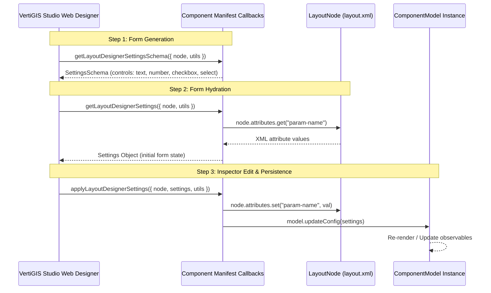

# VertiGIS Studio Web SDK: Layout & Application Configuration

## Overview
VertiGIS Studio Web uses a dual-file declarative architecture:
1. **`app.json` / `layout.xml` (Layout)**: Defines the visual layout hierarchy, container primitives (`<stack>`, `<split>`, `<panel>`), slotting, sizing, and presentation attributes.
2. **`app-config.json` (Configuration)**: Defines data models, services, component configurations, `$ref` bindings, `$eval` dynamic expressions, and command actions.

---

## 1. Core Layout Components

Layouts are defined using declarative XML in the `https://geocortex.com/layout/v1` namespace.

```xml
<?xml version="1.0" encoding="utf-8" ?>
<layout xmlns="https://geocortex.com/layout/v1"
        xmlns:web="https://geocortex.com/layout/web/v1"
        xmlns:custom="your.custom.namespace">
    
    <split resizable="true">
        <!-- Side Navigation Panel -->
        <panel width="26" active="true">
            <stack>
                <search config="search-config" />
                <results-list config="results-config" />
            </stack>
            <!-- Feature details overlays on top with auto-back navigation -->
            <feature-details config="details-config" />
        </panel>

        <!-- Main Map Container -->
        <map id="main-map" config="map-config" grow="1">
            <!-- Custom SDK Widget in Map Corner -->
            <custom:my-widget slot="top-right" margin="0.5" config="my-widget-config" />
            
            <!-- Standard Map Controls -->
            <stack slot="bottom-right" margin="0.5" halign="end">
                <zoom margin="0.2" />
                <web:scale-input margin="0.2" />
            </stack>
        </map>
    </split>
</layout>
```

### Visual Layout Primitives

| Component | Visual Behavior | Key Attributes |
| :--- | :--- | :--- |
| **`<stack>`** | Orders children **vertically** (top to bottom). | `grow`, `margin`, `padding`, `halign`, `valign` |
| **`<split>`** | Partitions children **horizontally** (left to right). | `resizable="true"`, `grow`, `margin`, `padding`, `valign` |
| **`<panel>`** | Hierarchical container with **stateful navigation stacking**. When a child component (like `<feature-details>`) is activated, it displays on top with an automatic back button. | `width`, `active`, `models` |
| **`<map>`** | Host viewport for the ArcGIS Map. Provides named slots for map tools. | `id`, `config`, `grow`, `slot` |
| **`<tab-container>`** | Multi-tab container displaying one active tab pane at a time. | `active`, `models` |
| **`<expander>`** | Collapsible accordion section. | `title`, `expanded="true\|false"` |
| **`<toolbar>`** | Linear bar holding buttons and tool menus. | `halign`, `valign`, `margin` |

---

## 2. Layout Presentation & Sizing Attributes

> 💡 **Units**: All dimensions (`width`, `height`, `margin`, `padding`) are in **`em`** units (where `1em` = the current font size, typically 15–16px), or standard CSS strings.

| Attribute | Type | Default | Description | Example |
| :--- | :--- | :--- | :--- | :--- |
| **`width`** | `number \| string` | natural size | Sets the width of a component. | `width="26"` (26em) or `width="350px"` |
| **`height`** | `number \| string` | natural size | Sets the height of a component. | `height="20"` (20em) |
| **`margin`** | `number` | `0` | Outer spacing outside the component. | `margin="0.5"` (0.5em) |
| **`padding`** | `number` | `0` | Inner spacing between container border and child content. | `padding="1"` (1em) |
| **`grow`** | `number` | `0` (or `1` for map/stack/split) | Proportional flex growth along the parent axis. `grow="0"` = natural size; `grow="1"` = expand to fill remaining space; `grow="2"` = expand with 2x relative weight. | `<map grow="1" />` |
| **`halign`** | `"start" \| "center" \| "end"` | `"start"` | Horizontal content/children alignment. | `halign="end"` |
| **`valign`** | `"start" \| "center" \| "end"` | `"start"` | Vertical content/children alignment. | `valign="center"` |
| **`resizable`** | `boolean` | `false` | Enables drag-to-resize divider bar on `<split>` containers. | `<split resizable="true">` |

---

## 3. Slotting & Positioning

Components placed inside containers with designated slots must specify the `slot` attribute:

### Standard Map Slots (`<map>`)
- `slot="top-left"`
- `slot="top-right"`
- `slot="top-center"`
- `slot="bottom-left"`
- `slot="bottom-right"`
- `slot="bottom-center"`
- `slot="main"` (underneath map controls)

---

## 4. Advanced Model Binding (`models` Attribute)

Components (like `<zoom>`, `<scalebar>`, or custom SDK widgets) often depend on a **`MapModel`** or other service models.

### Automatic Model Discovery:
1. **Ancestry Search**: VertiGIS walks up the layout tree from the component to find the nearest ancestor exporting the requested model (e.g. `<zoom>` nested inside `<map>` automatically binds to that map).
2. **Breadth-First Search**: If not found in ancestors, VertiGIS searches top-down from the root of the layout.

### Explicit Binding with `models` Selector:
When multiple maps exist or components sit outside the map hierarchy, use the `models` attribute to target specific component IDs:

```xml
<split>
    <!-- Bind all child widgets inside this panel to #map-a -->
    <panel id="left-panel" models="#map-a" width="23">
        <scalebar active="true" />
        <results-list />
    </panel>

    <map id="map-a" />
    <map id="map-b" />
</split>
```

---

## 5. Application Configuration (`app-config.json`)

`app-config.json` configures the models, data sources, and services instantiated by the layout:

```json
{
  "schemaVersion": "1.0",
  "items": [
    {
      "id": "my-widget-config",
      "itemType": "custom-widget-model",
      "title": "Inspection Dashboard",
      "autoRefreshInterval": 30,
      "map": {
        "$ref": "main-map"
      }
    },
    {
      "id": "main-map",
      "itemType": "map-extension",
      "webMap": "https://www.arcgis.com/sharing/rest/content/items/1234567890abcdef"
    }
  ]
}
```

### Model Binding Expressions

#### A. Reference Binding (`$ref`)
Inject an existing item model instance by its ID:
```json
{
  "map": {
    "$ref": "main-map"
  }
}
```

#### B. Evaluated Expressions (`$eval`)
Dynamically evaluate JavaScript expressions against the active app/user context:
```json
{
  "title": {
    "$eval": "app.title + ' - ' + user.username"
  },
  "isVisible": {
    "$eval": "user.hasRole('Admin')"
  }
}
```

#### C. Command Action Binding
Bind clicks or events to commands and command chains:
```json
{
  "id": "export-button",
  "itemType": "button",
  "title": "Export",
  "action": [
    "results.get-selected",
    "results.convert-to-csv",
    {
      "name": "system.download-file",
      "arguments": {
        "fileName": "features.csv"
      }
    }
  ]
}
```

### Theme & Design Token Integration

Layout containers (`<panel>`, `<split>`, `<stack>`) dynamically inherit background and border tokens configured in the `branding` service. In `app-config.json`, the `branding` service defines the active theme (`template: "light" | "dark"`), primary brand accent colors, and custom color overrides that populate the CSS variable subsystem:

```json
{
  "id": "branding",
  "service": "branding",
  "properties": {
    "template": "dark",
    "accentColor": "#007ac2",
    "colors": {
      "primaryBackground": "#1e1e1e",
      "primaryForeground": "#f5f5f5"
    }
  }
}
```

For complete instructions on defining custom light/dark color schemes, CSS token mappings, safe fallbacks, and runtime theme adaptation in custom components, refer to the [Design Tokens & Theming Guide](./11_design_tokens_and_theming.md).

---

## 6. Internationalization (i18n)

Translation bundles live in `src/locales/{lang}.json`:

```json
// src/locales/en.json
{
  "custom-widget-title": "Analytics Dashboard",
  "custom-widget-refresh": "Refresh Data"
}
```

### Accessing Translations in React Views:
```tsx
import * as React from "react";
import { useI18n } from "@vertigis/web/ui";
import { Typography } from "@mui/material";

export function CustomWidget() {
    const { translate } = useI18n();
    return (
        <Typography variant="h6" sx={{ color: "var(--primaryForeground)" }}>
            {translate("custom-widget-title")}
        </Typography>
    );
}
```

---

## 7. VertiGIS Studio Web Designer Settings Schema Protocol

When a component is selected in the VertiGIS Studio Web Designer layout tree or map viewport, Designer dynamically renders an inspector settings panel. This panel is powered by the **Designer Settings Schema Protocol** implemented on the component manifest:



### The Three Protocol Methods

#### 1. `getLayoutDesignerSettingsSchema` (Form Schema Declaration)
Informs the Designer inspector what fields to render, their input controls, labels, and validation rules:
- Combines or extends the default layout settings schema via `await getLayoutDesignerSettingsSchema(args)` to preserve standard layout controls (`margin`, `padding`, `halign`, `valign`, `slot`, `sizing`).
- Declares fields using supported types:
  - `text`: single-line or multi-line text input
  - `number`: numeric input or range slider (`min`, `max`, `step`)
  - `checkbox`: boolean toggle
  - `select`: dropdown picker (`values: SelectValue[]`)
  - `toggle`: button toggle group
  - `color`: color picker
  - `command`: command/workflow action selector
  - `group`: collapsible grouping of sub-settings

#### 2. `getLayoutDesignerSettings` (Form Hydration from XML)
Extracts attribute values currently present on the layout element in `layout.xml` via `args.node.attributes.get(...)` and populates the Designer form:
- XML attribute names conventionally follow kebab-case (e.g. `refresh-interval`, `show-border`, `accent-color`).
- Returns a typed settings object conforming to the schema.

#### 3. `applyLayoutDesignerSettings` (Persistence to XML & Model)
Invoked by Designer whenever the user modifies an inspector input field:
- Writes updated values back into the layout XML node via `args.node.attributes.set(...)`.
- For immediate live updates in Designer preview without requiring page reloads, propagates changes to the active model instance via `node.model.updateConfig(...)`.

### Implementation Example

```typescript
import { LibraryRegistry } from "@vertigis/web/config";
import {
    applyLayoutDesignerSettings,
    getLayoutDesignerSettings,
    getLayoutDesignerSettingsSchema,
    GetLayoutDesignerSettingsArgs,
    ApplyLayoutDesignerSettingsArgs,
    SettingsSchema,
} from "@vertigis/web/designer";
import MyWidget, { MyWidgetModel } from "./components/MyWidget";

interface MyWidgetLayoutSettings {
    title?: string;
    refreshInterval?: number;
    showBorder?: boolean;
    displayMode?: "compact" | "full";
}

export default function (registry: LibraryRegistry): void {
    registry.registerComponent({
        name: "my-widget",
        namespace: "custom.foo",
        getComponentType: () => MyWidget,
        itemType: "my-widget-model",
        getItemType: () => MyWidgetModel,
        title: "My Custom Widget",

        getLayoutDesignerSettingsSchema: async (
            args: GetLayoutDesignerSettingsArgs
        ): Promise<SettingsSchema<MyWidgetLayoutSettings>> => {
            const baseSchema = await getLayoutDesignerSettingsSchema(args);
            return {
                ...baseSchema,
                settings: [
                    ...(baseSchema.settings || []),
                    {
                        id: "title",
                        type: "text",
                        displayName: "Widget Title",
                        description: "Header title displayed in widget chrome",
                    },
                    {
                        id: "refreshInterval",
                        type: "number",
                        displayName: "Refresh Interval (s)",
                        description: "Background polling frequency",
                        min: 5,
                        max: 3600,
                    },
                    {
                        id: "showBorder",
                        type: "checkbox",
                        displayName: "Show Border",
                        description: "Whether to draw an outer border",
                    },
                    {
                        id: "displayMode",
                        type: "select",
                        displayName: "Display Mode",
                        description: "Layout density presentation",
                        values: [
                            { displayName: "Compact", value: "compact" },
                            { displayName: "Full / Expanded", value: "full" },
                        ],
                    },
                ],
            };
        },

        getLayoutDesignerSettings: async (
            args: GetLayoutDesignerSettingsArgs
        ): Promise<MyWidgetLayoutSettings> => {
            const baseSettings = await getLayoutDesignerSettings(args);
            return {
                ...baseSettings,
                title: (args.node.attributes.get("title") as string) || "Default Title",
                refreshInterval: Number(args.node.attributes.get("refresh-interval")) || 30,
                showBorder: args.node.attributes.get("show-border") === "true",
                displayMode: (args.node.attributes.get("display-mode") as "compact" | "full") || "full",
            };
        },

        applyLayoutDesignerSettings: async (
            args: ApplyLayoutDesignerSettingsArgs<MyWidgetLayoutSettings>
        ): Promise<void> => {
            await applyLayoutDesignerSettings(args);
            const { node, settings } = args;

            if (settings.title !== undefined) {
                node.attributes.set("title", settings.title);
            }
            if (settings.refreshInterval !== undefined) {
                node.attributes.set("refresh-interval", String(settings.refreshInterval));
            }
            if (settings.showBorder !== undefined) {
                node.attributes.set("show-border", String(settings.showBorder));
            }
            if (settings.displayMode !== undefined) {
                node.attributes.set("display-mode", settings.displayMode);
            }

            if (node.model && typeof (node.model as any).updateConfig === "function") {
                (node.model as any).updateConfig({
                    title: settings.title,
                    refreshInterval: settings.refreshInterval,
                    showBorder: settings.showBorder,
                    displayMode: settings.displayMode,
                });
            }
        },
    });
}
```
